<h1 align="center"> Ozoz bspwm dotfiles for Acer Predator Helios  </h1>

<!-- reviewing themes -->
[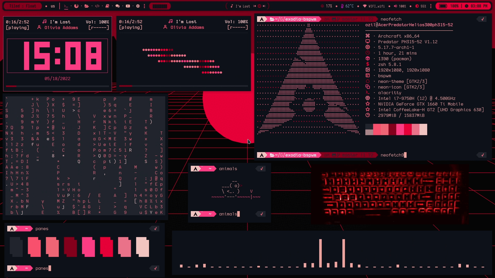](https://drive.google.com/file/d/1oAnRYYdb1zVIZLnppeKMABg10MFjrGJ6/view?usp=sharing)

<!-- reviewing themes -->

<!-- ###########################################  ########################################### -->

<!-- Table of content -->

### [Table of content](#table-of-content)

+ **Dependencies**
  - [**`Install the programs below in your system`**](#dependencies)
+ **Installation**
  - [**`How To Install dotfiles`**](#installation)
+ **Previews**
  - [**`reviewing available themes`**](#available-themes-previews)

<!-- Table of content -->

<!-- ###########################################  ########################################### -->

<!-- Dependencies -->

### Dependencies

- **WM** :- [**`bspwm`**](https://madnight.github.io/bspwm/) [**`wmname`**](https://archlinux.org/packages/?name=wmname) [**`sxhkd`**](https://wiki.archlinux.org/title/Sxhkd) [**`dunst`**](https://wiki.archlinux.org/title/Dunst)  [**`ksuperkey`**](https://github.com/hanschen/ksuperkey) [**`betterlockscreen`**](https://github.com/betterlockscreen/betterlockscreen)  [**`picom-ibhagwan-git`**](https://aur.archlinux.org/packages/picom-ibhagwan-git) [**`xclip`**](https://wiki.archlinux.org/title/clipboard)

- **Utilities** :- [**`rofi`**](https://github.com/davatorium/rofi) [**`polybar`**](https://github.com/polybar/polybar) [**`xorg-xsetroot`**](https://archlinux.org/packages/extra/x86_64/xorg-xsetroot/) [**`xsettingsd`**](https://wiki.archlinux.org/title/Xsettingsd) [**`xfce4-power-manager`**](https://wiki.archlinux.org/title/Power_management) [**`xfce-polkit`**](https://wiki.archlinux.org/title/Polkit)

- **Terminal Apps** :- [**`alacritty`**](https://alacritty.org/) [**`nvim`**](https://neovim.io/) [**`zsh`**](https://wiki.archlinux.org/title/zsh) [**`powerline`**](https://wiki.archlinux.org/title/Powerline) [**`power10k`**](https://github.com/romkatv/powerlevel10k)  [**`oh my zsh`**](https://ohmyz.sh/)

- **Media** :- [**`viewnior`**](https://archlinux.org/packages/community/x86_64/viewnior/) [**`gwenview`**](https://archlinux.org/packages/extra/x86_64/gwenview/) [**`nitrogen`**](https://wiki.archlinux.org/title/nitrogen) [**`feh`**](https://wiki.archlinux.org/title/feh) [**`thunar`**](https://wiki.archlinux.org/title/thunar) [**`mpd`**](https://wiki.archlinux.org/title/Music_Player_Daemon) [**`ncmpcpp`**](https://wiki.archlinux.org/title/ncmpcpp) [**`mpc`**](https://archlinux.org/packages/extra/x86_64/mpc/) [**`maim`**](https://github.com/naelstrof/maim)

- **Text Editor** :- [**`geany`**](https://www.geany.org/) [**`Visual Studio Code`**](https://code.visualstudio.com/) [**`inkdrop`**](https://www.inkdrop.app/)

- **Predator Sense App** :- [**`PredatorSenseCLI`**](https://github.com/JafarAkhondali/acer-predator-turbo-and-rgb-keyboard-linux-module) [**`PredatorSenseGUI`**](https://github.com/zehratullayl/Linux-Predator-GUI) [**`linux-headers`**](https://archlinux.org/packages/core/x86_64/linux-headers/)

<!-- Dependencies -->

<!-- ###########################################  ########################################### -->

<!-- Installation -->

### Installation

~~~bash

https://github.com/mmsaeed509/bspwm-dots.git
cd bspwm-dots

# Copy misc to home #
cp misc/* ~/

# Copy scripts to /bin #
sudo cp bin/* /bin

# Copy config to ~/.config #
cp -r config/* ~/.config

# Clean #
cd .. && rm -rf bspwm-dots
~~~

<!-- Installation -->

<!-- ###########################################  ########################################### -->

<!-- Available Themes Previews -->

<h2 align="center">Available Themes Previews</h2>

|Blade|CyberPunk|Hack|
|--|--|--|
| 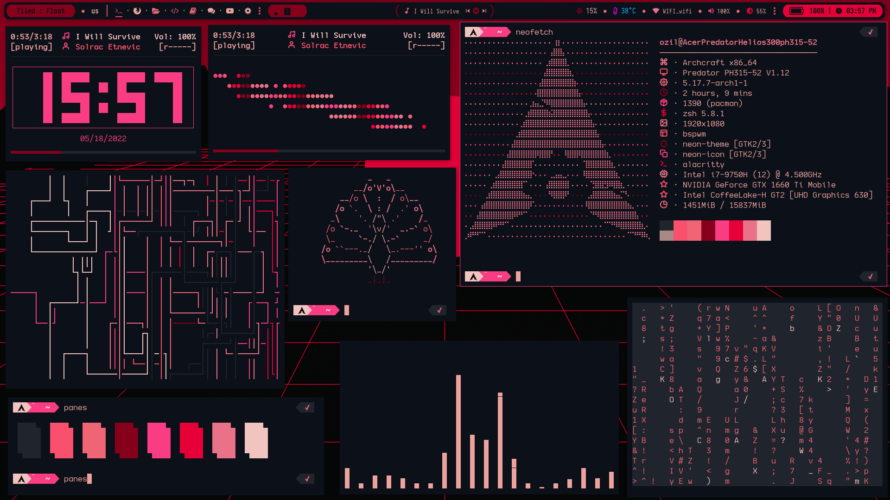 | 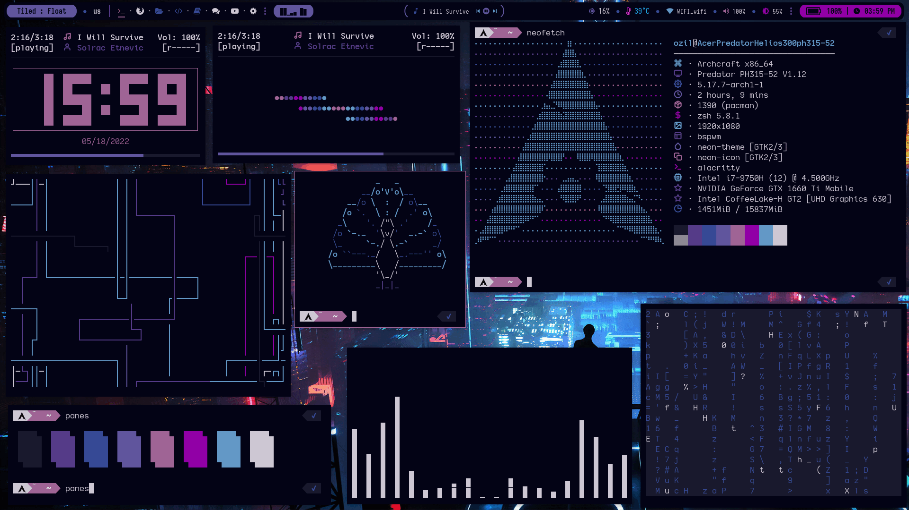 | 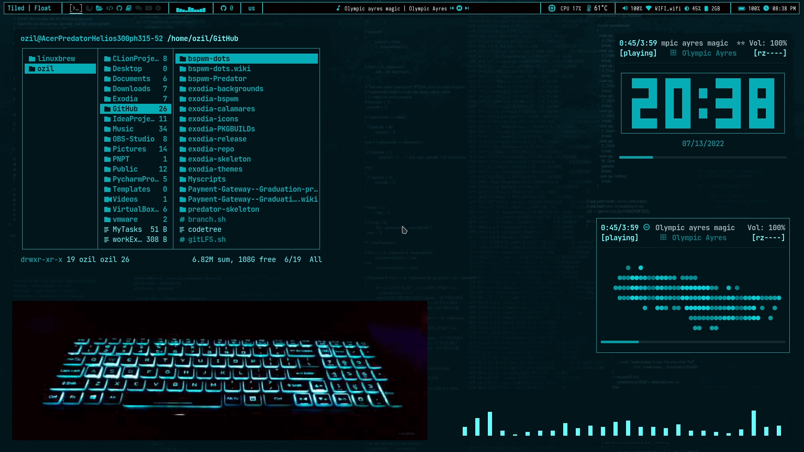 |

|Rick|Hack The Box|Hack The Box Colored|
|--|--|--|
| 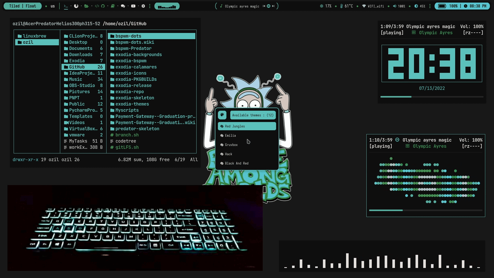 | 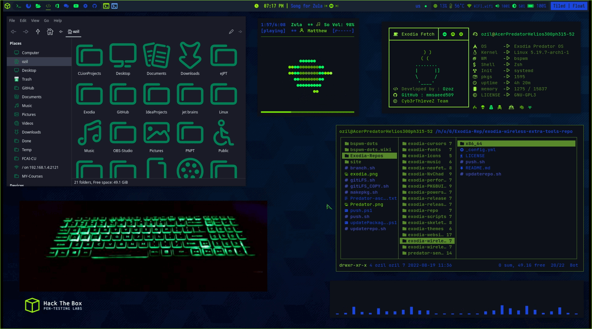 | 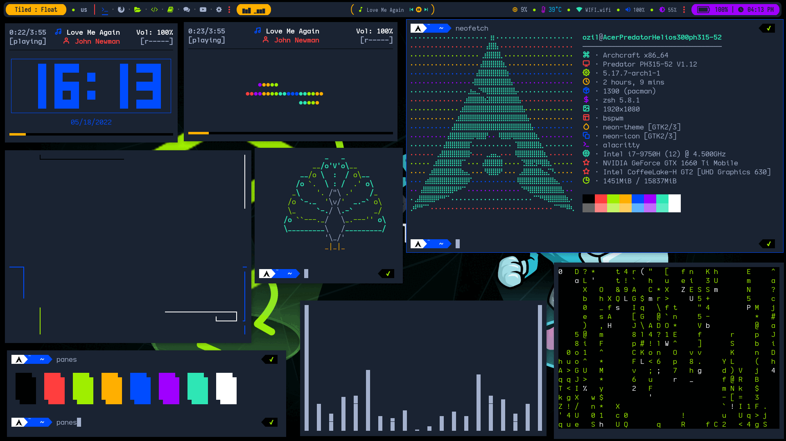 |

|BlackArch|Neon|Tigger In Atlantis|
|--|--|--|
| 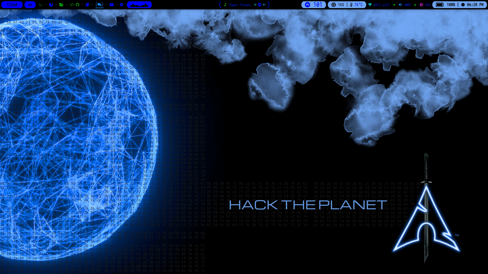 | 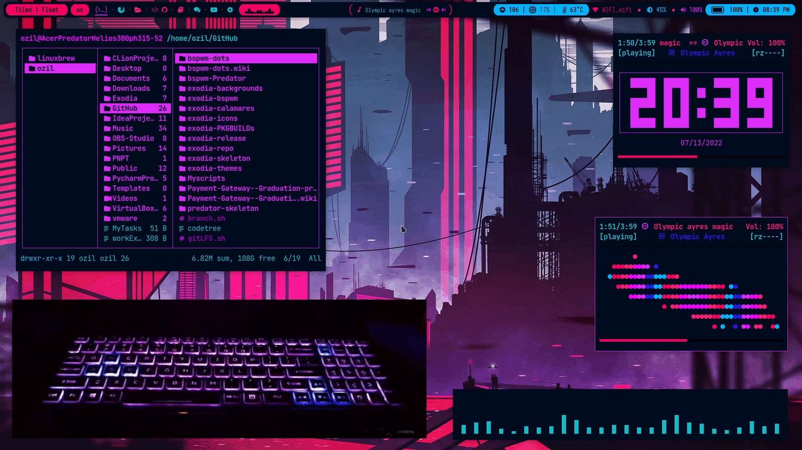 | 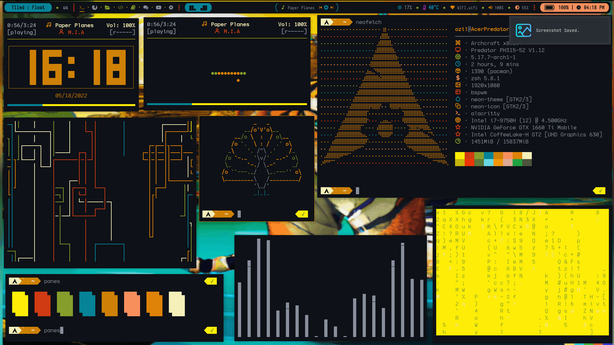 |

|Bouquet|Dracula|Nord|
|--|--|--|
| 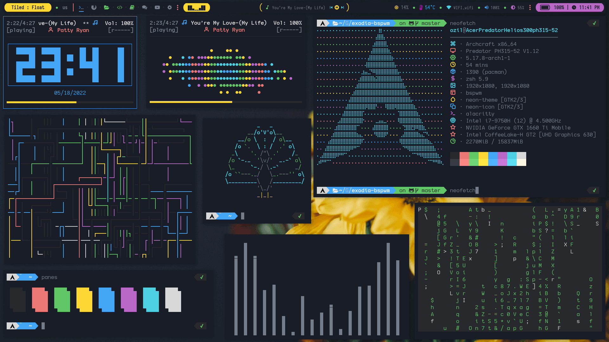 | 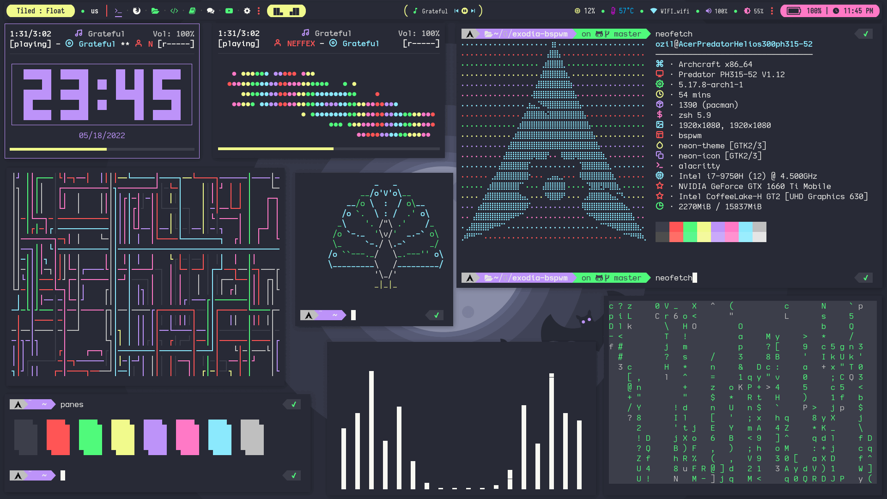 | 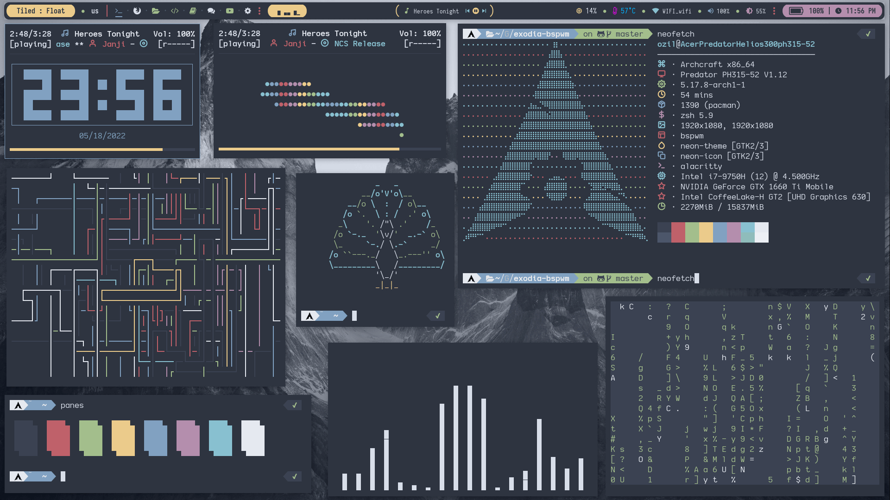 |

|Groot|Gruvbox|
|--|--|
| 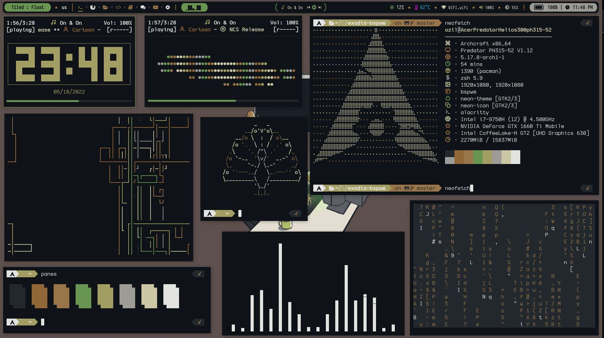 | 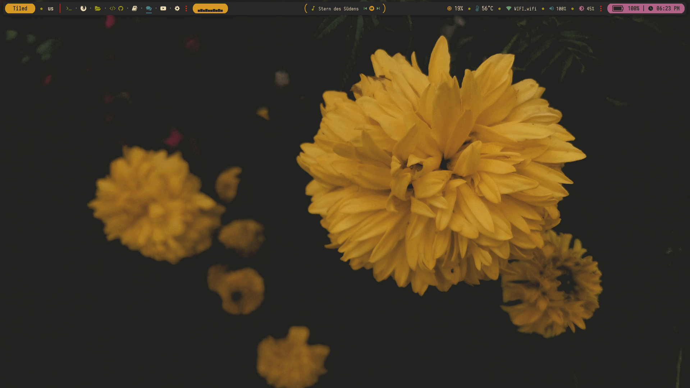 |

<!-- Available Themes Previews -->

<!-- ########################################### END ########################################### -->
